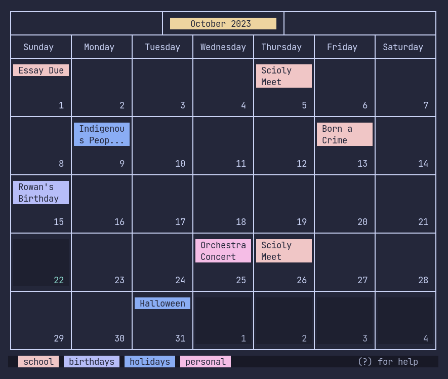
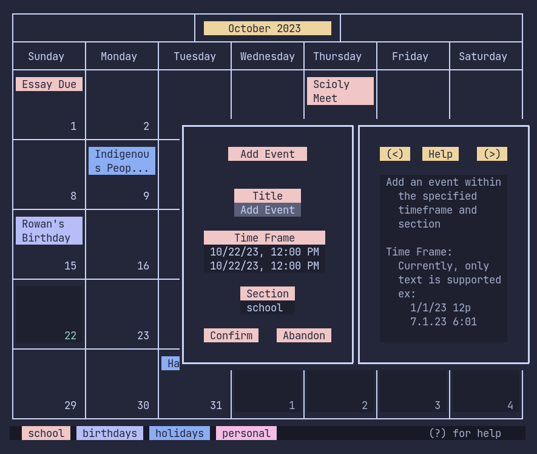
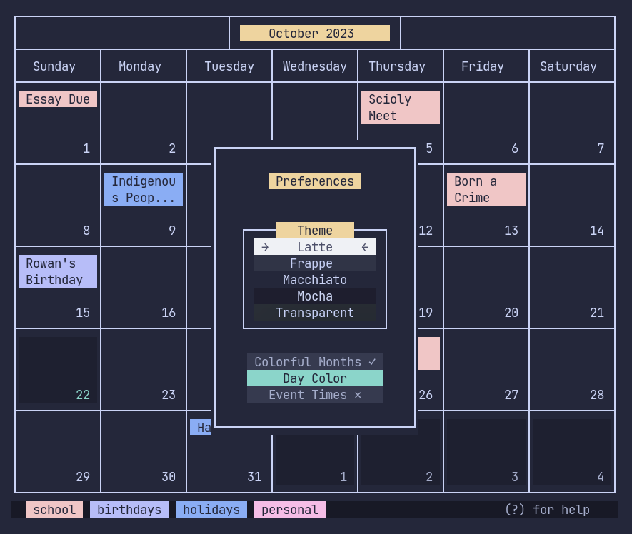
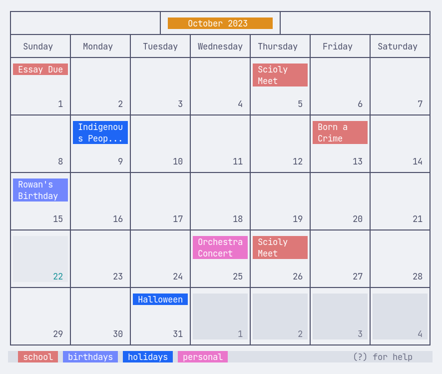
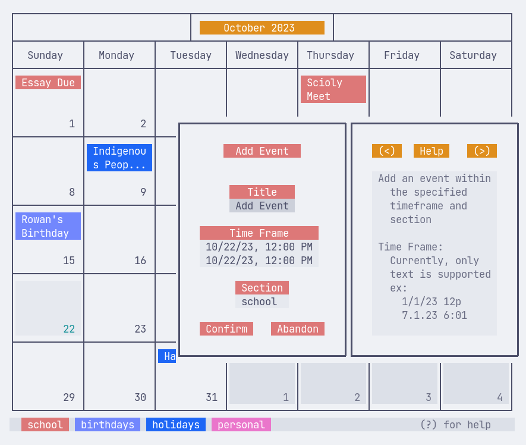
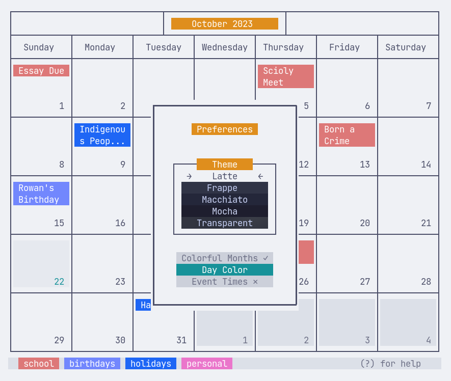

# Calendar

A simple Calendar app that I wrote in a week for class. 

## Usage

### Linux / Mac

Run `run.sh`

### Windows

Run `run.bat`. If there's issues with color, run `chcp 932` before running

## Gallery

    
    
    

    
    
    

